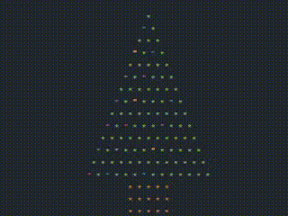

# Christmas tree for the Terminal
Christmas tree in C that outputs in your terminal
<br>


## How to make it work?
```
#clone the repo
git clone https://github.com/ImNotASkidLolus/Christmas-tree-for-the-terminal.git

#go to the repo directory
cd Christmas-tree-for-the-terminal/

#build the tool
make
sudo make install

#run using:
xmass-tree
```
## If you want to change the colors
change these lines in the code by comenting the first one and uncommenting the other:
```C
const char* colors[] ={"\e[1;33m", "\e[0;34m", "\e[0;35m", "\e[0;36m","\e[0;31m", "\e[0;37m", "\e[0;32m"};
//const char* colors[] ={"\e[1;32m", "\e[0;31m", "\e[0;37m"};
```
Then you will need to build it again so do this before bulding the program
